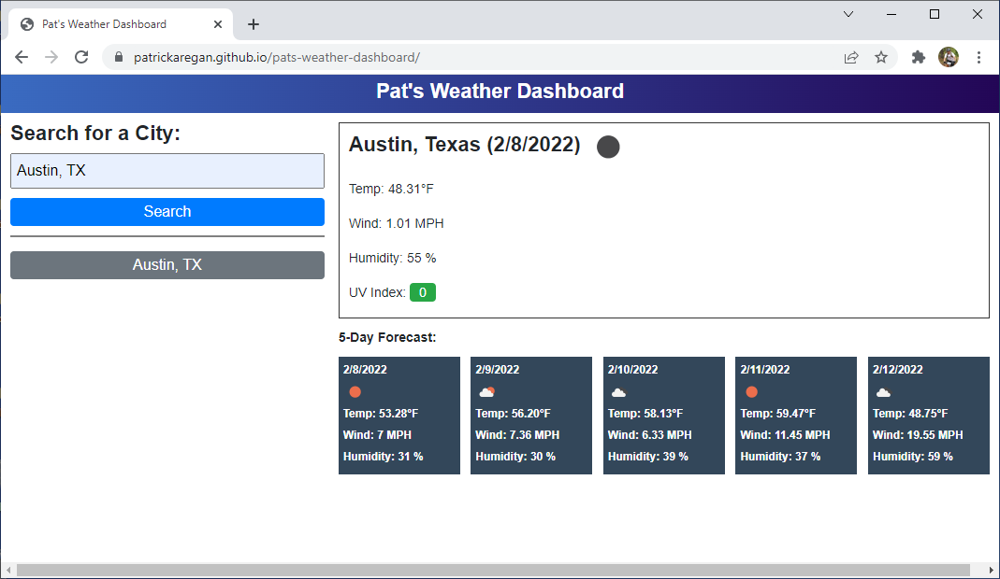

# pats-weather-dashboard
Pat's Weather Dashboard

## Description
- This project is a weather dashboard that shows current weather and a five day forecast.
- It also stores previous weather searches so the user can easily re-run past searches.
- Weather apps are very useful and I use one every day. I may start using this one.
- This project was very interesting as it was the first time I used a public API in any of my projects. It was very intersting to console log the object returned from the API and look at all the data it contains. A few things I noticed about the OpenWeather One Call API are below:
- The One Call API takes latitude and longitude coordinates as input so you have to use another API to get those coordinates for a city. I used the Geocoding API for that.
- To get the weather icon you must read the documentation to know what url to use for the image.
- The forecast data does not contain a single temperature value, which makes sense because it is a forecast, so I averaged the Min and Max temperatures to show a single temperature value.
- This was a challenging project due to the number of data items we needed to display but I really enjoyed learning how to use an API.

## Screenshot

## Link
[https://patrickaregan.github.io/pats-weather-dashboard/](https://patrickaregan.github.io/pats-weather-dashboard/)
